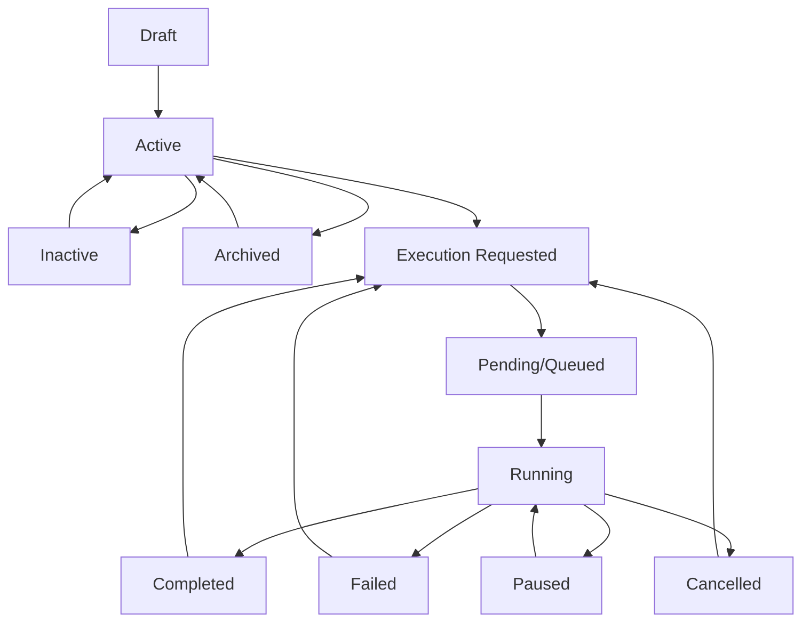
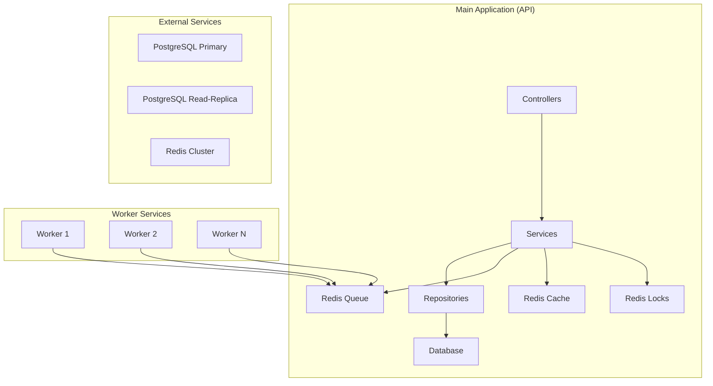
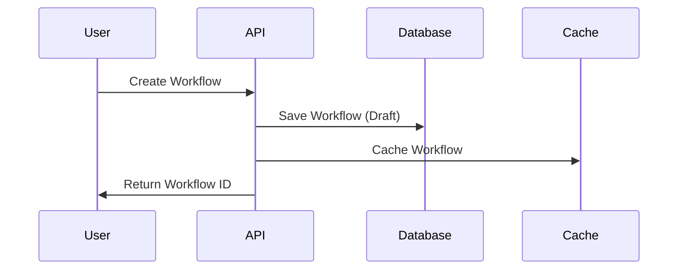
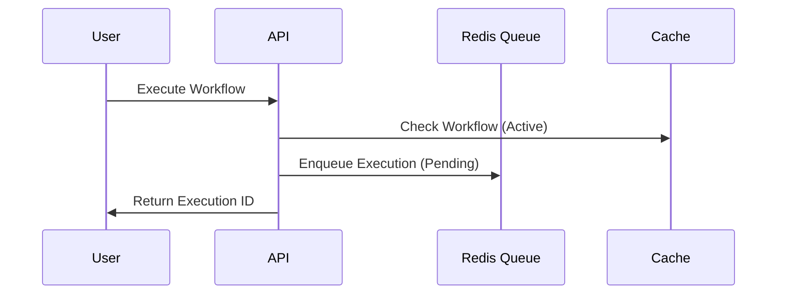
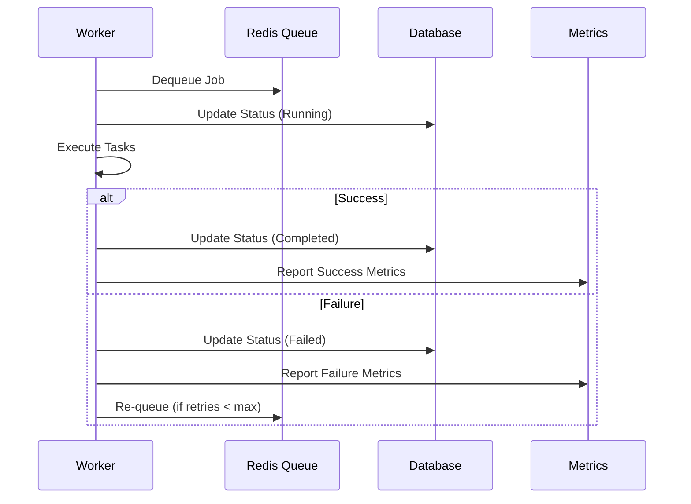
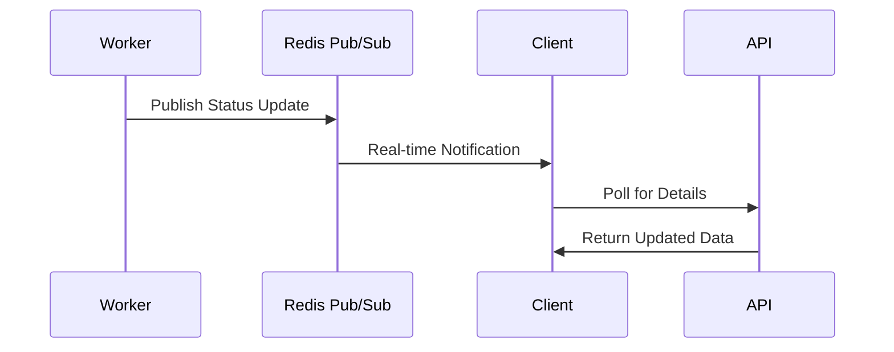

# Workflow System State Machine & Architecture

## Overview

The Workflow System implements a robust state machine for workflow execution with horizontal scaling capabilities. This document explains the status transitions, state machine flow, and how the main application coordinates with worker services.

## Workflow Status State Machine

### Status Definitions

```csharp
public enum WorkflowStatus
{
    Draft,      // Initial state - workflow is being created/edited
    Active,     // Workflow is ready for execution
    Inactive,   // Workflow is disabled but preserved
    Archived    // Workflow is archived (read-only)
}
```

```csharp
public enum ExecutionStatus
{
    Pending,    // Queued for execution (waiting in queue)
    Running,    // Currently being executed by a worker
    Completed,  // Successfully finished
    Failed,     // Execution failed with error
    Cancelled,  // Manually cancelled by user
    Paused      // Temporarily paused (can be resumed)
}
```

### Workflow Lifecycle



### Status Transition Rules

#### Workflow Status Transitions

| From | To | Condition | Action |
|------|----|-----------|---------|
| Draft | Active | Workflow is valid and published | Enable execution |
| Active | Inactive | Admin disables workflow | Disable new executions |
| Active | Archived | Admin archives workflow | Preserve for historical data |
| Inactive | Active | Admin re-enables workflow | Allow new executions |
| Archived | Active | Admin restores workflow | Re-enable for execution |

#### Execution Status Transitions

| From | To | Condition | Action |
|------|----|-----------|---------|
| - | Pending | Execution requested | Add to Redis queue |
| Pending | Running | Worker picks up job | Start execution timer |
| Running | Completed | All tasks succeed | Store results, update metrics |
| Running | Failed | Any task fails | Log error, trigger retry if possible |
| Running | Cancelled | User cancels | Stop execution, cleanup |
| Running | Paused | System pause | Save state, wait for resume |
| Paused | Running | Resume triggered | Restore state, continue |
| Completed | Pending | Re-execution requested | Queue for new execution |
| Failed | Pending | Retry enabled | Re-queue with retry count |

## Application Architecture

### Main Application (API)

The main application serves as the **orchestrator** and **API gateway**:



### Horizontal Scaling Components

#### 1. **API Layer** (Main Application)
- **Role**: Request handling, workflow management, user interface
- **Scaling**: Stateless, can be scaled horizontally
- **Responsibilities**:
  - HTTP API endpoints
  - Workflow CRUD operations
  - User authentication/authorization
  - Request validation
  - Response formatting

#### 2. **Worker Services**
- **Role**: Background job processing
- **Scaling**: Can be scaled independently based on queue load
- **Responsibilities**:
  - Pick up jobs from Redis queue
  - Execute workflow tasks
  - Update execution status
  - Handle retries and failures
  - Report metrics

#### 3. **Database Layer**
- **Primary**: Write operations, workflow definitions
- **Read-Replica**: All read queries for better performance
- **Responsibilities**:
  - Workflow persistence
  - Execution history
  - User data
  - Audit logs

#### 4. **Redis Layer**
- **Queue**: Job queuing and distribution
- **Cache**: Frequently accessed data
- **Locks**: Distributed locking for concurrency
- **Pub/Sub**: Real-time notifications

## Execution Flow

### 1. Workflow Creation


### 2. Workflow Execution Request


### 3. Worker Processing


### 4. Real-time Updates


## Configuration for Horizontal Scaling

### Environment Variables

```bash
# Database Connections
DefaultConnection=Host=primary-db;Database=workflows;Username=app;Password=secret
ReadOnlyConnection=Host=replica-db;Database=workflows;Username=app;Password=secret

# Redis Configuration
Redis=localhost:6379

# Scaling Configuration
MaxWorkers=10
QueueTimeout=300
RetryAttempts=3
```

### Kubernetes Deployment

#### API Deployment
```yaml
apiVersion: apps/v1
kind: Deployment
metadata:
  name: workflowsystem-api
spec:
  replicas: 3
  selector:
    matchLabels:
      app: workflowsystem-api
  template:
    spec:
      containers:
      - name: api
        image: workflowsystem-api:latest
        env:
        - name: DefaultConnection
          valueFrom:
            secretKeyRef:
              name: db-secret
              key: primary-connection
        - name: ReadOnlyConnection
          valueFrom:
            secretKeyRef:
              name: db-secret
              key: replica-connection
```

#### Worker Deployment
```yaml
apiVersion: apps/v1
kind: Deployment
metadata:
  name: workflowsystem-worker
spec:
  replicas: 5
  selector:
    matchLabels:
      app: workflowsystem-worker
  template:
    spec:
      containers:
      - name: worker
        image: workflowsystem-worker:latest
        env:
        - name: DefaultConnection
          valueFrom:
            secretKeyRef:
              name: db-secret
              key: primary-connection
```

#### Horizontal Pod Autoscaler
```yaml
apiVersion: autoscaling/v2
kind: HorizontalPodAutoscaler
metadata:
  name: workflowsystem-api-hpa
spec:
  scaleTargetRef:
    apiVersion: apps/v1
    kind: Deployment
    name: workflowsystem-api
  minReplicas: 3
  maxReplicas: 10
  metrics:
  - type: Resource
    resource:
      name: cpu
      target:
        type: Utilization
        averageUtilization: 70
```

## Monitoring & Observability

### Key Metrics

1. **Queue Metrics**
   - Queue length
   - Processing rate
   - Wait time

2. **Execution Metrics**
   - Success/failure rate
   - Average execution time
   - Retry count

3. **System Metrics**
   - CPU/Memory usage
   - Database connections
   - Redis performance

### Health Checks

```csharp
// API Health Check
GET /health
{
  "status": "healthy",
  "database": "connected",
  "redis": "connected",
  "queue": "operational"
}

// Worker Health Check
GET /health
{
  "status": "healthy",
  "workerId": "worker-123",
  "processedJobs": 150,
  "queueLength": 5
}
```

## Best Practices

### 1. **Idempotency**
- All operations must be idempotent
- Use unique execution IDs
- Handle duplicate requests gracefully

### 2. **Error Handling**
- Implement exponential backoff for retries
- Log all errors with context
- Provide meaningful error messages

### 3. **Performance**
- Use read-replica for all queries
- Cache frequently accessed data
- Implement connection pooling

### 4. **Security**
- Validate all inputs
- Use parameterized queries
- Implement proper authentication/authorization

### 5. **Monitoring**
- Set up alerts for critical metrics
- Monitor queue length and processing time
- Track error rates and response times

## Troubleshooting

### Common Issues

1. **Queue Backlog**
   - Scale up workers
   - Check for stuck jobs
   - Monitor database performance

2. **High Error Rate**
   - Check logs for specific errors
   - Verify database connectivity
   - Review workflow definitions

3. **Performance Issues**
   - Check read-replica lag
   - Monitor Redis performance
   - Review caching strategy

### Debug Commands

```bash
# Check queue length
redis-cli LLEN workflow:execution:queue

# Check worker status
kubectl get pods -l app=workflowsystem-worker

# Check API health
curl http://api-service/health

# Check database connections
kubectl exec -it api-pod -- netstat -an | grep 5432
```

## Conclusion

This architecture provides:
- ✅ **Horizontal scaling** for both API and workers
- ✅ **High availability** with multiple instances
- ✅ **Performance optimization** with read-replicas
- ✅ **Real-time processing** with Redis queues
- ✅ **Comprehensive monitoring** and observability
- ✅ **Robust error handling** and retry mechanisms

The system can handle high loads by scaling workers independently based on queue length, while the API layer scales based on HTTP request load. 